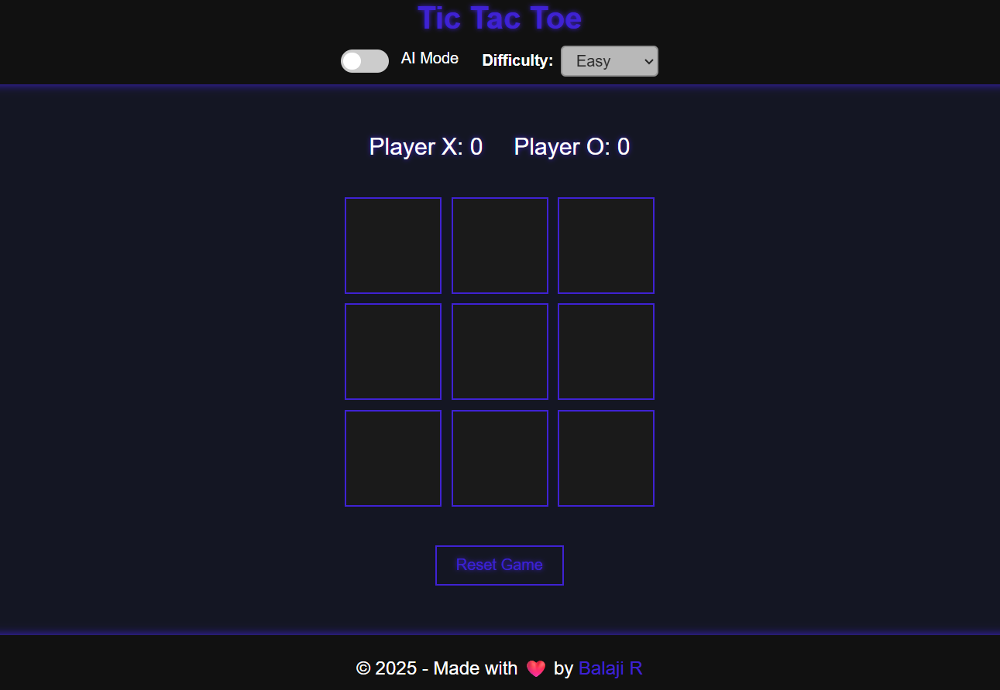

# Tic Tac Toe
A fun Tic Tac Toe game with optional AI modes — Random, Minimax and a sneaky mix! Challenge your brain, test strategies, and enjoy a polished game with animations and fireworks on victory!



## 🌐 Live Demo
Play now: [https://Balaji-R-05.github.io/tic-tac-toe/](https://Balaji-R-05.github.io/tic-tac-toe/)

## Tech Stack
- HTML5
- CSS3
- Javascript

## 🚀 Features
- 2-player gameplay
- Win/draw detection
- Game reset option
- Responsive design

## Getting Started
### 1. Clone the Repo
```bash
git clone https://github.com/Balaji-R-05/tic-tac-toe.git
cd tic-tac-toe
```
### 2. Open index.html in any browser


## 🤝 Contributing

We welcome your ideas, suggestions, and improvements!

**Fork it. Improve it. Build on it.**  
Whether you want to fix a bug, add a feature, or just explore, feel free to dive in!  
✨ Don't forget to ⭐ the repo if you find it useful or fun!