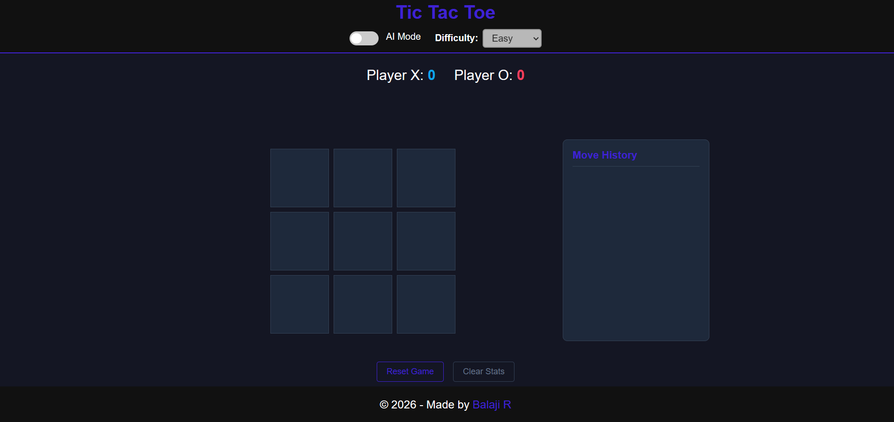
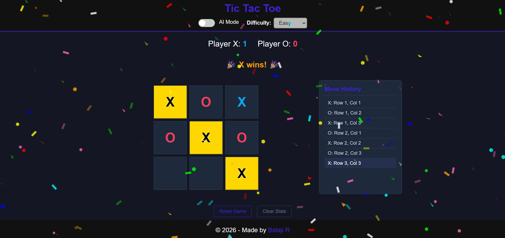

# Tic-Tac-Toe

A beautifully designed, responsive Tic-Tac-Toe game featuring a minimalist flat UI, smart AI opponents, and persistent statistics.





## 🌐 Live Demo
Experience the game here: **[Live Demo](https://Balaji-R-05.github.io/tic-tac-toe/)**


## ✨ Features

- **Multiple Game Modes**: Play against a friend locally or challenge the computer.
- **Smart AI**: Choose from three difficulty levels (Easy, Medium, Hard) powered by the Minimax algorithm.
- **Persistent Stats**: Your win/loss records are saved to `localStorage`, so your progress is never lost.
- **Move History**: Track every move made during the game in a side-by-side (desktop) or bottom (mobile) scrollable list.
- **Responsive Design**: Fully optimized for mobile, tablet, and desktop viewing.
- **Visual Feedback**: High-contrast winning highlights and celebratory fireworks animations.


## 🛠️ Tech Stack

- **Frontend**: HTML5, CSS3 (Vanilla), JavaScript (ES6+)
- **Animations**: [Confetti-JS](https://github.com/MathuSumuti/confetti-js) for victory celebrations.
- **Typography**: [Inter](https://fonts.google.com/specimen/Inter) from Google Fonts.


## Getting Started

### 1. Clone the repository
```bash
git clone https://github.com/Balaji-R-05/tic-tac-toe.git
cd tic-tac-toe
```

### 2. Run the application
Simply open `index.html` in your favorite web browser! No compilation or installation required.


## 🤝 Contributing

Contributions are what make the open-source community such an amazing place to learn, inspire, and create. Any contributions you make are **greatly appreciated**.

1. Fork the Project
2. Create your Feature Branch (`git checkout -b feature/AmazingFeature`)
3. Commit your Changes (`git commit -m 'Add some AmazingFeature'`)
4. Push to the Branch (`git push origin feature/AmazingFeature`)
5. Open a Pull Request